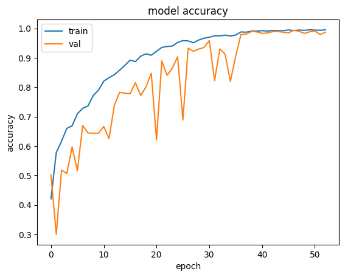
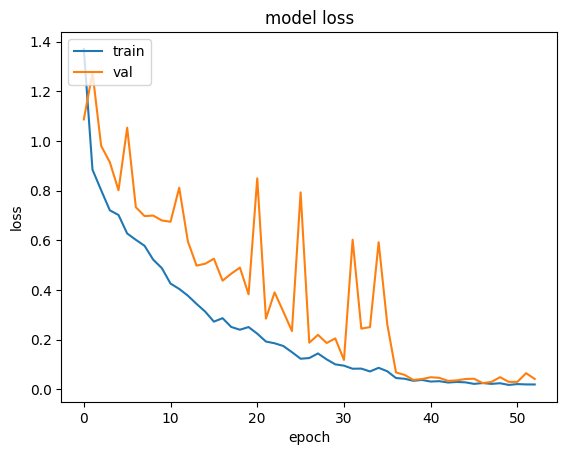
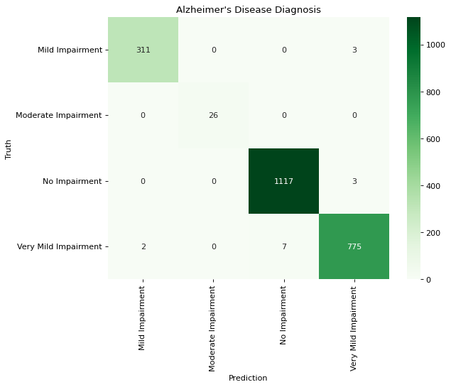
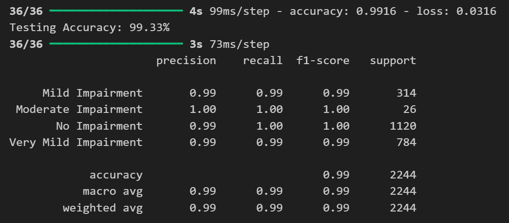

# Alzheimer Diagnosis CNN Model

## Project Description

This project uses Convolutional Neural Networks (CNN) to diagnose Alzheimer's disease from brain MRI images. The model is trained to classify different stages of Alzheimer's disease, including:

- **Mild Impairment**: Mild cognitive impairment
- **Moderate Impairment**: Moderate cognitive impairment
- **Very Mild Impairment**: Very mild cognitive impairment
- **No Impairment**: No signs of cognitive impairment

## Project Structure

```
├── Alzheimer Dataset/                    # Original dataset
├── Alzheimer Dataset (Augmented)/        # Augmented dataset
├── cnn_custom_model_v3.ipynb            # Custom CNN model training notebook
├── transfer_learning_models.ipynb       # Transfer learning experiments notebook
├── test_saved_model.ipynb               # Saved model testing notebook
├── Alzheimer_diagnosis_cnn_custom_model(99.33%).h5  # Trained model (99.33% accuracy)
└── README.md                            # Project description file
```

## System Requirements

- Python 3.7+
- TensorFlow 2.x
- Keras
- NumPy
- Pandas
- Matplotlib
- Seaborn
- OpenCV
- Scikit-learn

## Installation

```bash
pip install tensorflow keras numpy pandas matplotlib seaborn opencv-python scikit-learn
```

## Usage

### 1. Model Training

Open and run the `cnn_custom_model_v3.ipynb` notebook to train the custom CNN model.

### 2. Model Testing

Use the `test_saved_model.ipynb` notebook to test the saved model.

### 3. Transfer Learning

Experiment with pre-trained models through the `transfer_learning_models.ipynb` notebook.

## Model Architecture

The custom CNN model includes:

- **Convolutional Layers**: Extract features from MRI images
- **Pooling Layers**: Reduce size and increase invariance
- **Dropout Layers**: Prevent overfitting
- **Dense Layers**: Final classification
- **Activation Functions**: ReLU for hidden layers, Softmax for output layer

## Training Results

### Model Accuracy

The custom CNN model achieved **99.33%** accuracy on the test set.

### Training Results Visualization

<!-- Insert training result images here -->

#### 1. Loss and Accuracy Plot by Epoch




*Plot showing the changes in loss and accuracy during training*

#### 2. Confusion Matrix



*Confusion matrix showing the model's classification performance for each class*

#### 3. Classification Report



*Detailed report on precision, recall, and f1-score for each class*

## Model Evaluation

### Key Metrics:

- **Accuracy**: ~99.33%
- **Precision**: ~99% (average)
- **Recall**: ~99% (average)
- **F1-Score**: ~99% (average)

## Dataset

- **Total images**: 16,650 MRI images
- **Split**: 
  - Training: 60% (10,204 images)
  - Validation: 25% (4166 images)
  - Test: 15% (2244 images)
- **Image size**: 128x128 pixels
- **Format**: Grayscale

## License

This project is distributed under the MIT License. See the `LICENSE` file for more details.

**Note**: This model is for research and educational purposes only. Do not use for actual medical diagnosis without supervision from medical specialists.